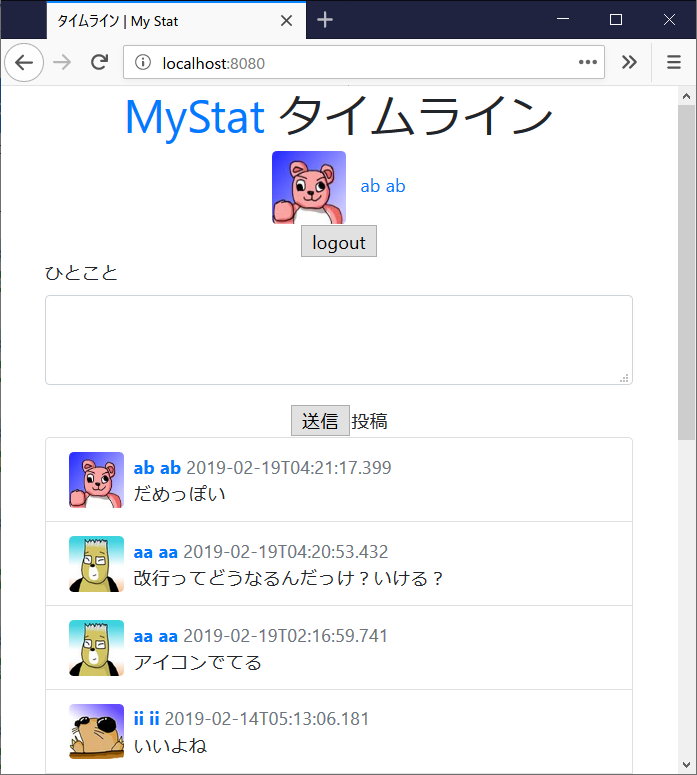
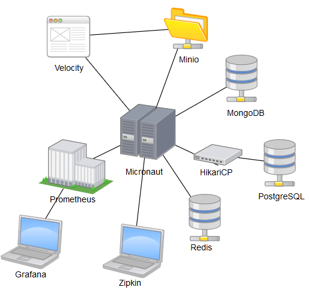

# Micronaut sample

The sample of Micronaut
[Micronaut Framework](https://micronaut.io/)

PostgreSQL as RDBMS
MongoDB as NoSQL
Minio as Object Server(S3 compatible)
Redis as Cache Server
Zipkin as Tracing
Prometheus as Monitoring

